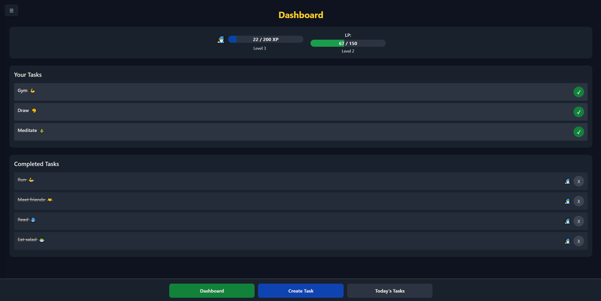
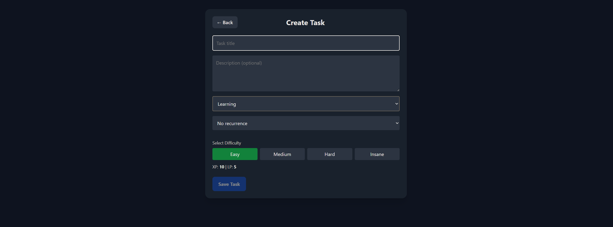
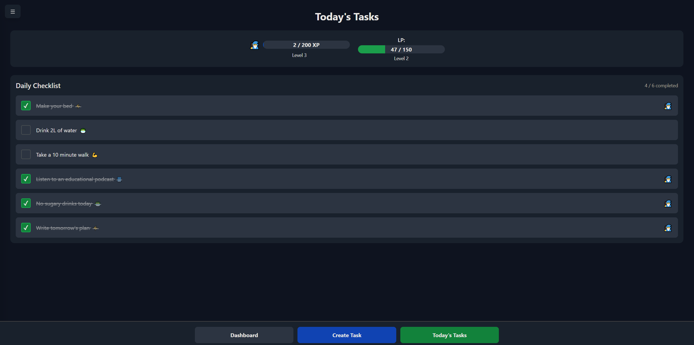
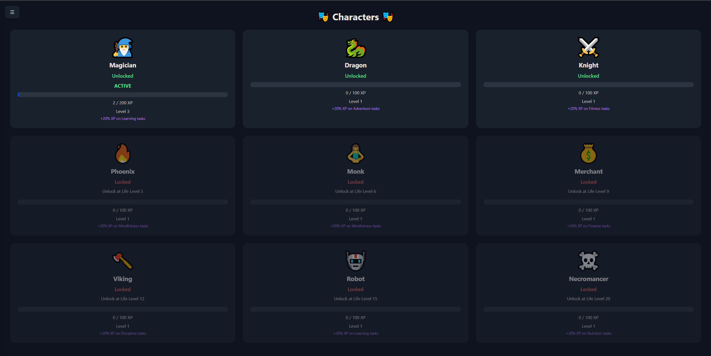
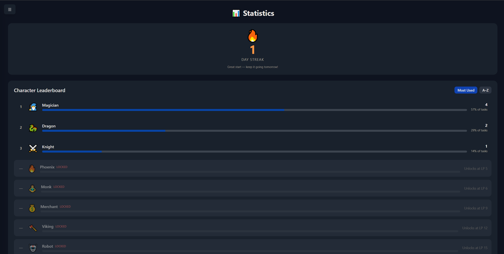
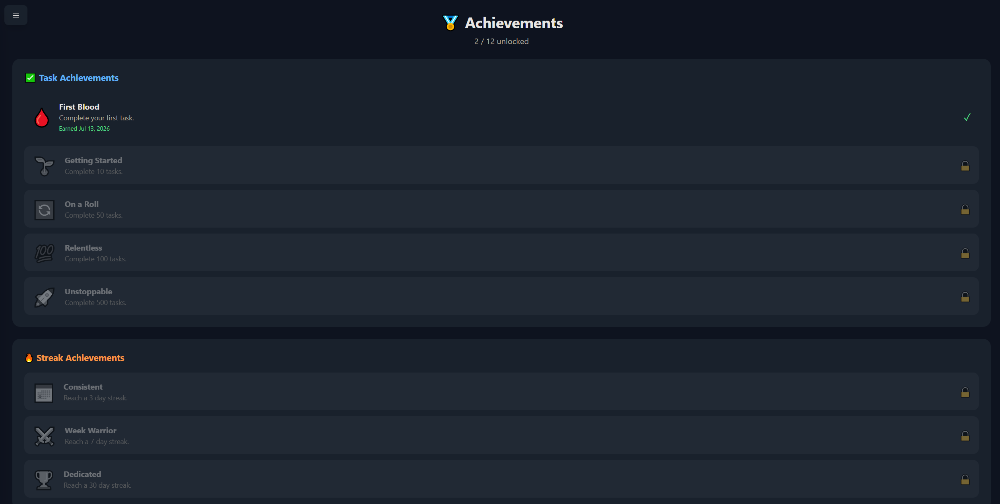
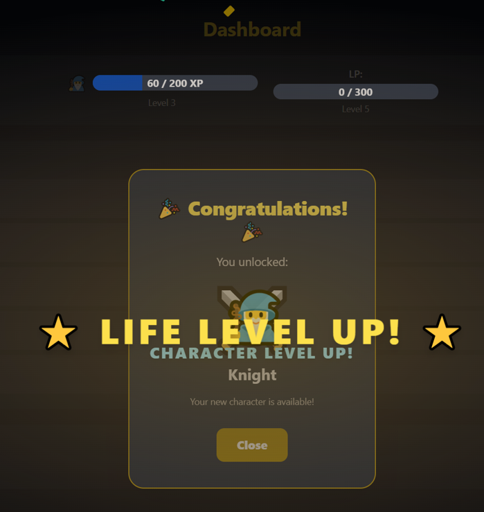
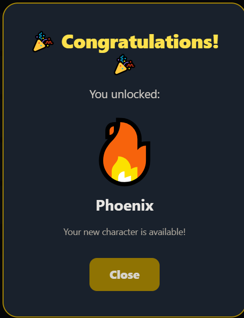
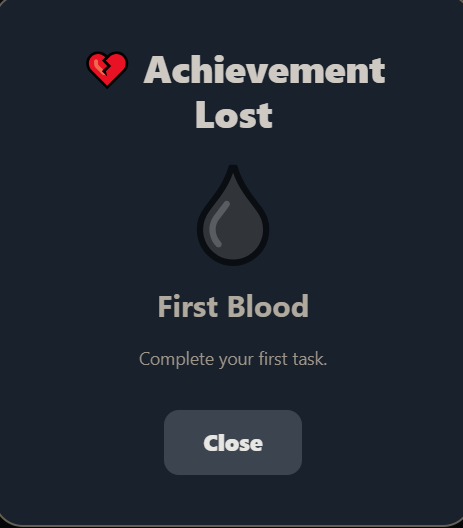
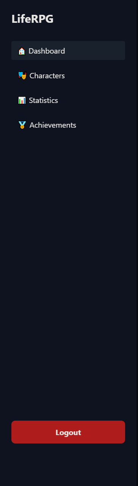

# LifeRPG

LifeRPG is a full-stack gamified productivity application that turns real-life tasks and habits into an RPG progression system. Users complete tasks to earn XP and Life Points, level up characters, maintain streaks, and unlock new characters as they progress.

Built as a portfolio project to demonstrate full-stack .NET development skills.

## Tech Stack

**Frontend**
- Angular 20 (standalone components)
- TypeScript
- Tailwind CSS

**Backend**
- ASP.NET Core Web API (.NET 9)
- Entity Framework Core (code-first migrations)
- JWT Authentication with BCrypt password hashing

**Database**
- PostgreSQL

## Features

**Authentication & Security**
- JWT-based authentication — every protected endpoint requires a valid signed token
- BCrypt password hashing — passwords are never stored in plain text
- Per-user data isolation — users can only access their own tasks, characters, and stats

**Task System**
- Create, edit, and delete tasks with title, description, category, difficulty, and recurrence
- Four difficulty tiers (Easy / Medium / Hard / Insane) with corresponding XP values
- Daily and one-time task support
- Task categories with icons and color coding (Fitness, Finance, Learning, Mindfulness, Nutrition, Social, Creativity, Adventure, Discipline)

**RPG Progression**
- Life Points (LP) system tied to the user account — completing tasks earns LP, uncompleting removes it
- Character XP system — XP is awarded to whichever character is active at completion time
- Level-up system with increasing thresholds per level
- Character-specific XP bonuses — each character gives +20% XP on their specialty category
- If a task is completed with a bonus and then uncompleted, the exact bonus amount is correctly removed

**Characters**
- 9 unlockable characters (Magician, Dragon, Knight, Phoenix, Monk, Merchant, Viking, Robot, Necromancer)
- Characters unlock at specific LP levels
- Forced character switch if LP drops below a character's unlock requirement
- Each character has a specialty category that grants an XP bonus

**Daily Tasks**
- Auto-generated daily checklist of 6 random healthy habits from a pool of 15
- Tasks are categorized and award XP/LP on completion
- Character bonus applies to daily tasks too
- Daily tasks are isolated per user and reset each day

**Achievements**
- 12 achievements across 3 categories: task completion milestones, streak milestones, LP level milestones
- Achievements are correctly awarded and revoked based on current stats
- Earned date tracked per user

**Statistics Page**
- Daily streak counter with motivational messaging
- Character leaderboard showing tasks completed per character, % share of total completions
- Sort by most used or alphabetically
- Locked characters shown but greyed out

**Celebration System**
- Character XP level-up animation (blue/purple flash)
- Life level-up animation (gold flash + confetti)
- Character unlock modal on level-up
- Character locked modal on level-down
- Achievement earned/lost modals with queue support (multiple modals shown sequentially)
- Forced character switch modal

**UI & UX**
- Floating XP/LP popup on task completion showing actual awarded values including bonuses
- Category emoji shown on task cards
- Character emoji shown next to completed tasks indicating which character earned the XP
- Side drawer navigation available on all pages
- Smooth drawer open/close animation without flash on page load

## Architecture Highlights

- **JWT middleware pipeline** — authentication runs before authorization in the ASP.NET middleware chain
- **DTO pattern** — all API responses use dedicated Data Transfer Objects, never raw entity models
- **Progression helper** — XP/LP addition and removal logic is centralized in a static helper class
- **User state service** — Angular singleton service acts as client-side state manager, emitting events for level-ups, unlocks, and achievements that drive the celebration system
- **HTTP interceptor** — automatically attaches JWT token to every outgoing Angular HTTP request
- **Optimistic UI** — task completion state updates instantly in the UI before the backend responds, with rollback on error

## Status

🚧 Active development — core features complete, UI improvements and additional features in progress.

## Screenshots

> The screenshots below represent the current state of development. A full UI overhaul is planned for the final stages of the project, including polished design, animations, and mobile optimization. The goal is a production-quality interface that matches the depth of the underlying system.

